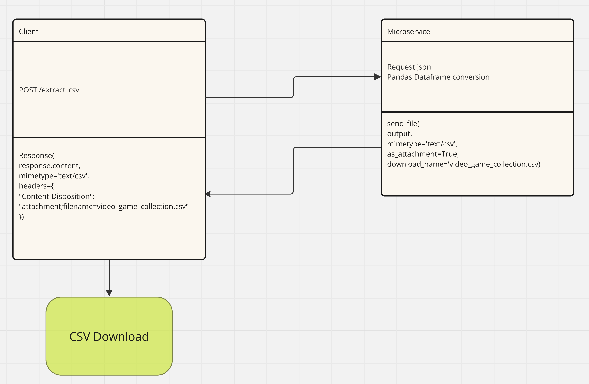

# Communication Contract for CSV Extraction Microservice

## Service Overview

The CSV Extraction Microservice provides an API endpoint to convert JSON data into a CSV file. Clients can send JSON data via a POST request, and the service will return the data as a downloadable CSV file.

## UML Diagram




## API Endpoint

- **URL:** `/extract_csv`  
- **Method:** `POST`  
- **Port:** `5001`

## Request Format

### Headers

- `Content-Type`: `application/json`

#### POST|Response Example

@app.route('/extract_csv', methods=['POST'])
def extract_csv():
    response = requests.post('http://localhost:5001/extract_csv', json=data)
    
    return Response(
    response.content,
    mimetype='text/csv',
    headers={
        "Content-Disposition": "attachment;filename=video_game_collection.csv"
    }
)


### Request Body And Example

The request body should contain JSON data that will be converted to a CSV format. The JSON data should represent a list of records (dictionaries) where each dictionary corresponds to a row in the resulting CSV file. For example:

```json
[
    {
        "column1": "value1",
        "column2": "value2",
        "column3": "value3"
    },
    {
        "column1": "value4",
        "column2": "value5",
        "column3": "value6"
    }
]


data = [
    {"Name": "Rampage", "Year": 1986, "Publisher": "Nintendo", "Platform": "N", "Currently Owned": "N", "Previously Beaten": "Y", "Looking To Purchase": "Y"},
    {"Name": "Maniac Mansion", "Year": 1987, "Publisher": "Nintendo", "Platform": "N", "Currently Owned": "N", "Previously Beaten": "Y", "Looking To Purchase": "Y"},
    {"Name": "Zombies Ate My Neighbors", "Year": 1993, "Publisher": "Super Nintendo", "Platform": "N", "Currently Owned": "Y", "Previously Beaten": "Y", "Looking To Purchase": "Y"},
    {"Name": "Golden Eye 007", "Year": 1997, "Publisher": "Nintendo 64", "Platform": "Y", "Currently Owned": "Y", "Previously Beaten": "N", "Looking To Purchase": "N"},
    {"Name": "Tony Hawk's Pro Skater 3", "Year": 2002, "Publisher": "N", "Platform": "Y", "Currently Owned": "Y", "Previously Beaten": "Y", "Looking To Purchase": "Y"}
]